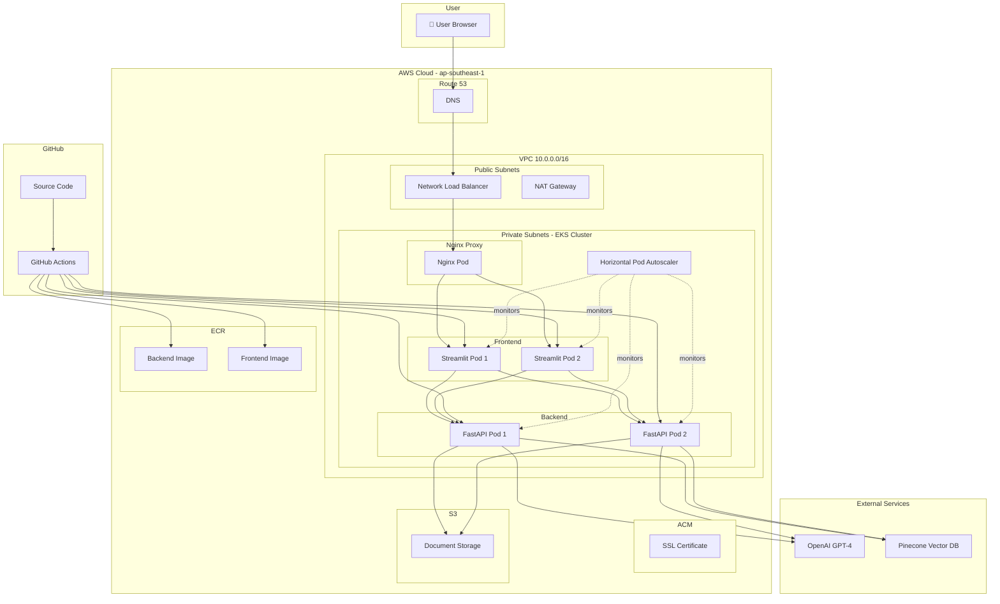
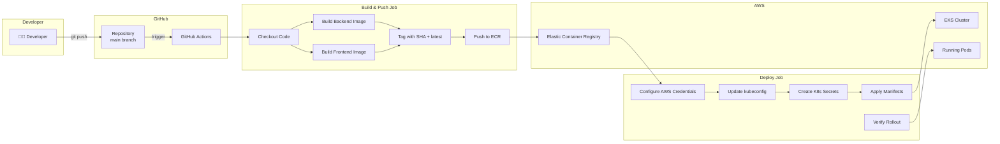
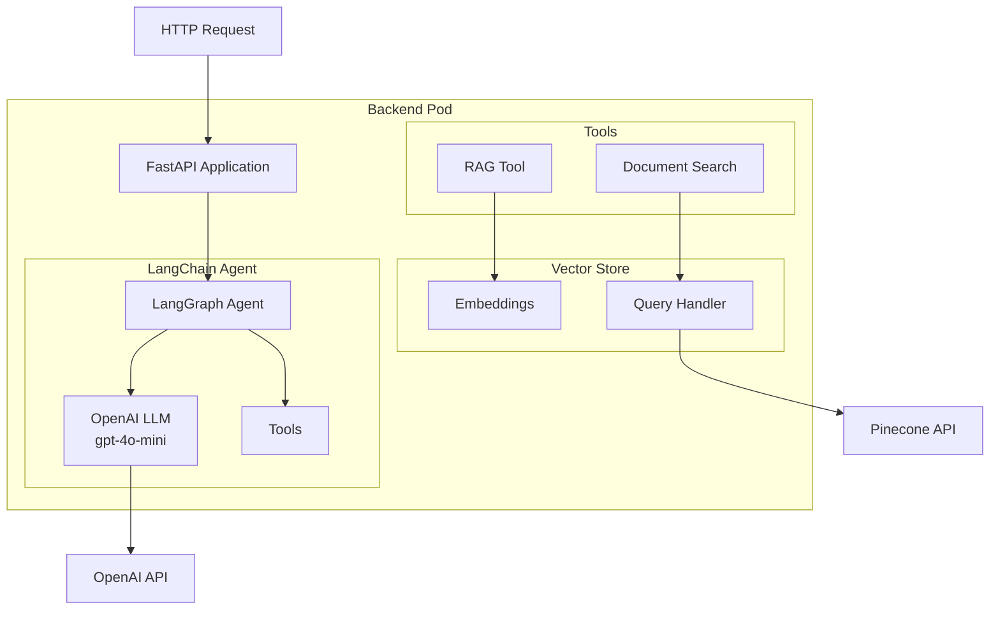
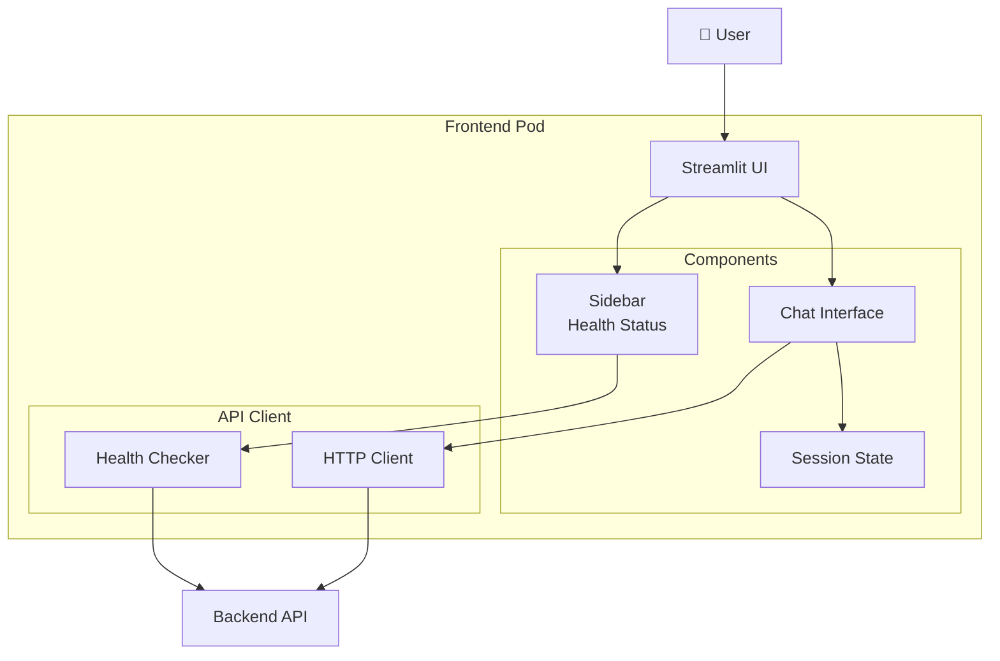
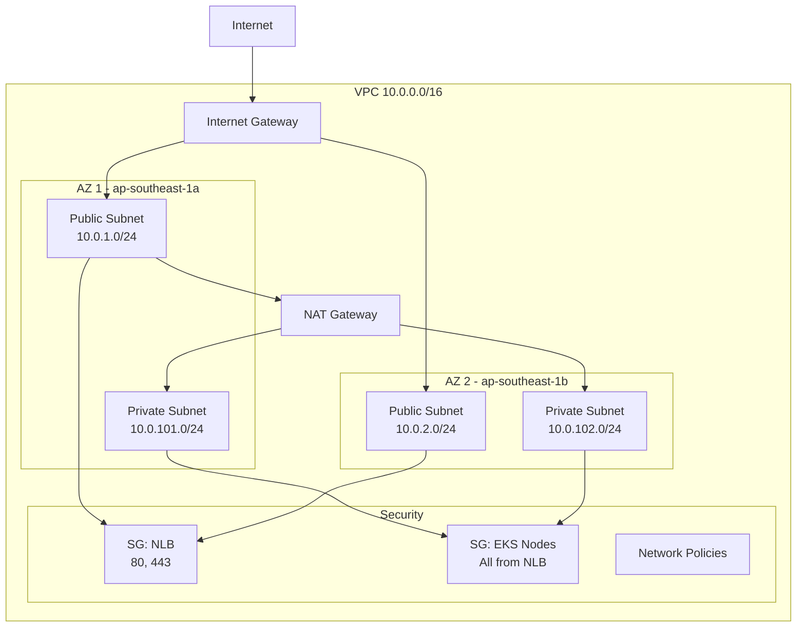
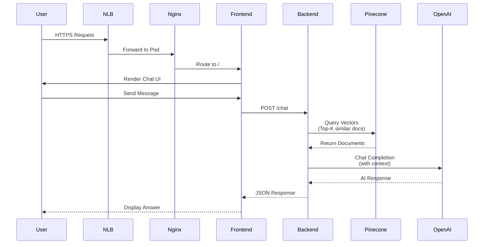
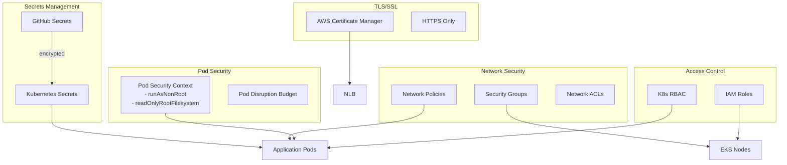
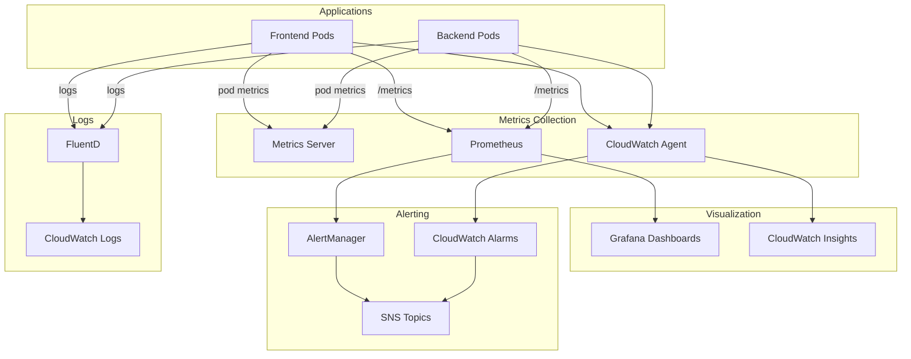
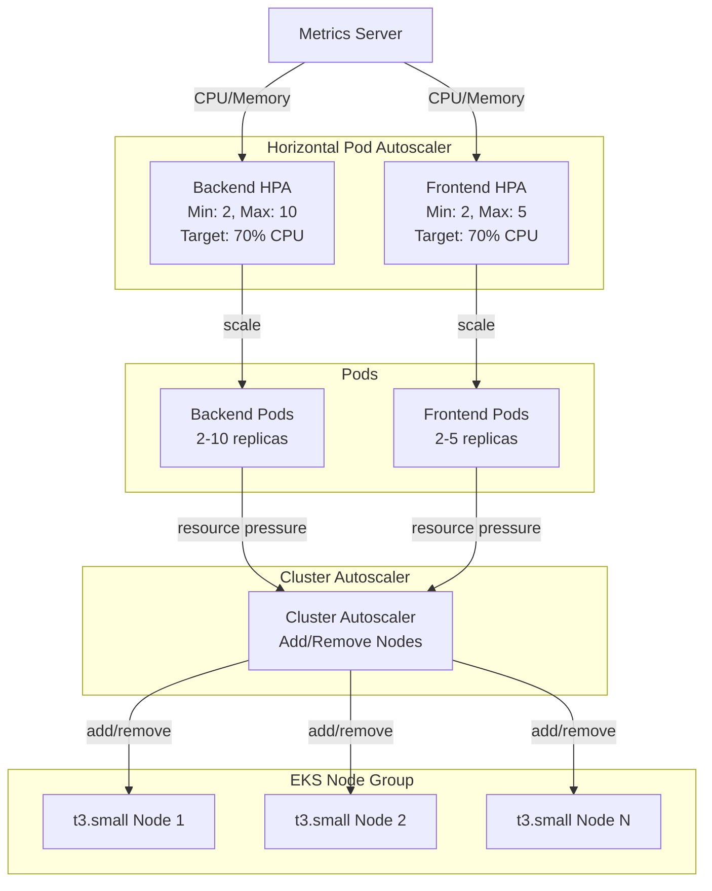
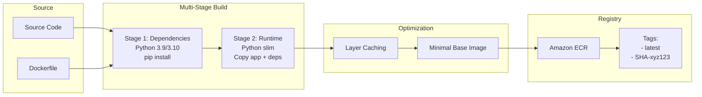

# 🏗️ Architecture Documentation

## Overview

AI Platform with RAG (Retrieval-Augmented Generation) deployed on AWS EKS with full CI/CD automation.

---

## 🎯 High-Level Architecture



---

## 🔄 CI/CD Pipeline Architecture



---

## 🧩 Component Architecture

### Backend (FastAPI + LangChain)



### Frontend (Streamlit)



---

## 🌐 Network Architecture



---

## 💾 Data Flow Architecture



---

## 🔐 Security Architecture



---

## 📊 Monitoring & Observability



---

## 🚀 Scaling Architecture



---

## 📦 Container Image Build Process



---

## 🗂️ Directory Structure Alignment

```
my-ai-platform/
├── .github/
│   ├── workflows/
│   │   └── deploy.yml              # CI/CD Pipeline
│   └── SECRETS_SETUP.md            # Secrets Documentation
│
├── backend-agent/
│   ├── main.py                     # FastAPI + LangChain Agent
│   ├── embed_documents.py          # Pinecone Embedding
│   ├── Dockerfile                  # Multi-stage build
│   └── requirements.txt            # Python dependencies
│
├── frontend-ui/
│   ├── app.py                      # Streamlit UI
│   ├── Dockerfile                  # Multi-stage build
│   └── requirements.txt
│
├── infrastructure/
│   └── main.tf                     # Terraform (VPC, EKS, ECR, S3)
│
├── k8s-manifests/
│   ├── deployment.yaml             # Backend/Frontend Deployments & Services
│   ├── nginx-ingress.yaml          # Nginx Proxy, HPA, PDB
│   ├── network-policy.yaml         # Network isolation rules
│   └── MONITORING.md               # Observability guide
│
├── nginx.conf                      # Nginx reverse proxy config
├── docker-compose.yml              # Local development
├── DEPLOYMENT.md                   # Production deployment guide
├── NEXT_STEPS.md                   # Post-deployment actions
└── README.md                       # Project overview
```

---

## 🔄 Infrastructure as Code

### Terraform Resources Created

```hcl
# VPC Module
module "vpc" {
  cidr            = "10.0.0.0/16"
  azs             = 2 (ap-southeast-1a, ap-southeast-1b)
  public_subnets  = [10.0.1.0/24, 10.0.2.0/24]
  private_subnets = [10.0.101.0/24, 10.0.102.0/24]
  nat_gateways    = 1 (shared)
  enable_dns      = true
}

# EKS Module
module "eks" {
  cluster_version       = "1.30"
  cluster_name          = "my-ai-platform-eks"
  endpoint_public       = false
  endpoint_private      = true
  
  node_groups = {
    main = {
      instance_types = ["t3.small"]
      min_size       = 1
      max_size       = 3
      desired_size   = 1
    }
  }
}

# ECR Repositories
resource "aws_ecr_repository" "backend" {
  name = "my-ai-platform-backend-agent"
  image_scanning = true
}

resource "aws_ecr_repository" "frontend" {
  name = "my-ai-platform-frontend-ui"
  image_scanning = true
}

# S3 Bucket
resource "aws_s3_bucket" "documents" {
  bucket = "my-ai-platform-raw-docs-${random_suffix}"
  versioning = enabled
  encryption = AES256
}
```

---

## 🎯 Technology Stack Summary

| Layer | Technology | Purpose |
|-------|-----------|---------|
| **Frontend** | Streamlit 1.31+ | Chat UI |
| **Backend** | FastAPI 0.110+ | REST API |
| **AI Agent** | LangChain 0.2+, LangGraph | Orchestration |
| **LLM** | OpenAI GPT-4o-mini | Text Generation |
| **Vector DB** | Pinecone 4.0+ | Similarity Search |
| **Container Runtime** | Docker 29.1+ | Containerization |
| **Orchestration** | Kubernetes 1.30 | Pod Management |
| **Cloud Platform** | AWS EKS | Managed K8s |
| **CI/CD** | GitHub Actions | Automation |
| **IaC** | Terraform 1.5+ | Infrastructure |
| **Reverse Proxy** | Nginx 1.25 | Load Balancing |
| **Monitoring** | Prometheus + Grafana / CloudWatch | Observability |
| **Secrets** | Kubernetes Secrets | Credential Management |

---

## 📊 Cost Estimation (Monthly)

| Service | Type | Quantity | Cost (USD) |
|---------|------|----------|------------|
| EKS Cluster | Control Plane | 1 | $73 |
| EC2 (t3.small) | Worker Nodes | 1-3 | $15-45 |
| NAT Gateway | Networking | 1 | $32 |
| Network Load Balancer | Load Balancing | 1-2 | $16-32 |
| ECR | Image Storage | ~5 GB | $0.50 |
| S3 | Document Storage | ~10 GB | $0.25 |
| **CloudWatch** | Logs & Metrics | Standard | $10-20 |
| **Data Transfer** | Egress | ~100 GB | $9 |
| **External APIs** | | | |
| - OpenAI | API Calls | Variable | $10-50 |
| - Pinecone | Vector Search | Starter tier | $70 |
| **TOTAL** | | | **~$235-350/month** |

**Optimization Tips:**
- Use Spot Instances for nodes: **Save 70%**
- Scale to zero during off-hours: **Save 50%**
- Use S3 Intelligent Tiering: **Save 30%**

---

## 🔍 Key Metrics to Monitor

### Application Metrics
- **Request Rate**: requests/second
- **Response Time**: p50, p95, p99 latency
- **Error Rate**: 4xx, 5xx errors
- **Chat Messages**: messages/hour
- **RAG Queries**: queries/minute
- **Token Usage**: OpenAI tokens consumed

### Infrastructure Metrics
- **Pod CPU**: % utilization
- **Pod Memory**: GB used
- **Node CPU**: % utilization
- **Pod Restarts**: count
- **HPA Events**: scale up/down
- **Network I/O**: GB transferred

### Business Metrics
- **Active Users**: concurrent users
- **Session Duration**: average length
- **Query Success Rate**: %
- **Cost per Query**: USD
- **Document Upload Rate**: docs/day

---

**Architecture maintained by:** AI Platform Team  
**Last Updated:** Phase 3 - CI/CD Pipeline Complete  
**Version:** 1.0.0
